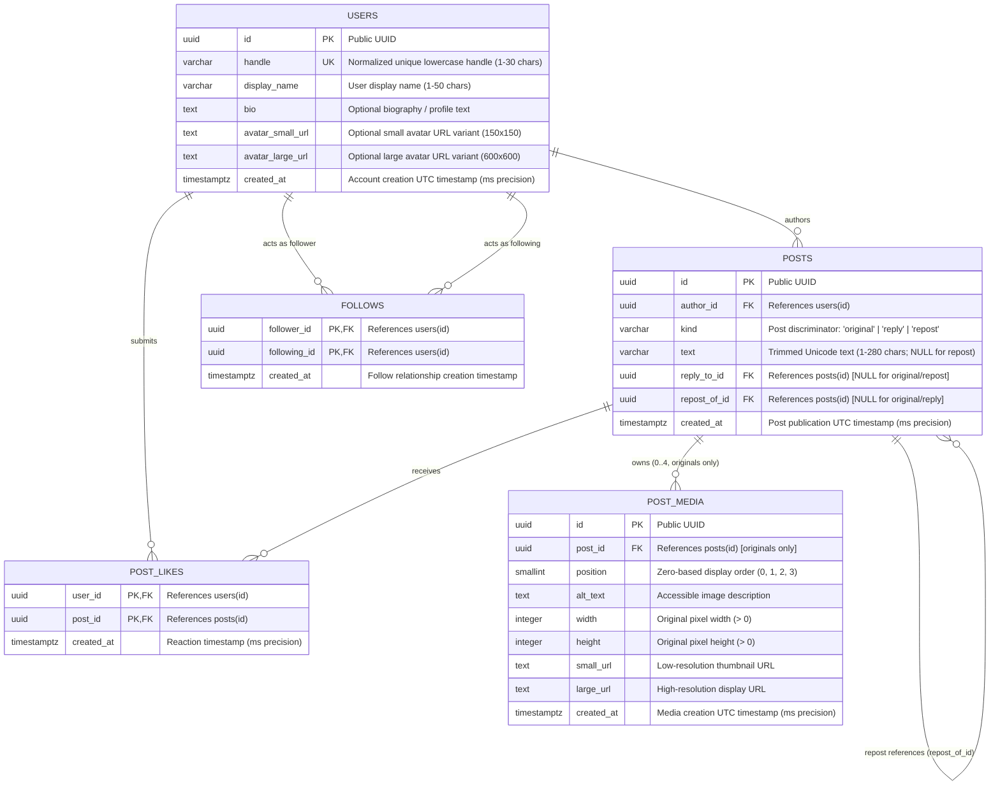

# Entity-Relationship Diagram (ERD) — Stage B

This document presents the conceptual and logical Entity-Relationship Diagram for the **Social Feed** application. It maps the five core entities required by the shared contract and PRD 03: **User**, **Post**, **PostMedia**, **Like**, and **Follow**.

---

## 1. Mermaid Entity-Relationship Diagram

---

## 2. Cardinality & Relationship Breakdown

| Relationship | Entities Involved | Cardinality & Optionality | Description / Relational Invariants |
|---|---|---|---|
| **Authoring** | `users` → `posts` | **1 to 0..*** (One-to-Many) | A user can author zero or many posts. Every post must have exactly one author (`author_id NOT NULL`). |
| **Direct Replies** | `posts` (parent) → `posts` (child reply) | **1 to 0..*** (One-to-Many self-reference) | An original post can receive zero or many replies. A reply references exactly one parent original via `reply_to_id`. Replies-to-replies are rejected. |
| **Repost References** | `posts` (parent) → `posts` (child repost) | **1 to 0..*** (One-to-Many self-reference) | An original post can be reposted zero or many times. A repost references exactly one parent original via `repost_of_id`. A user can repost a given original at most once (`UNIQUE (author_id, repost_of_id)`). |
| **Post Media** | `posts` → `post_media` | **1 to 0..4** (One-to-Many) | An original post can have 0 to 4 media items. Media rows belong only to original posts. Display order within a post is defined by `position` (0..3). `(post_id, position)` is unique. |
| **Post Likes** | `users` ↔ `posts` via `post_likes` | **0..* to 0..*** (Many-to-Many) | A user can like zero or many posts; a post can be liked by zero or many users. A user can like a given post at most once. Enforced via composite primary key `(user_id, post_id)`. |
| **Follow Graph** | `users` ↔ `users` via `follows` | **0..* to 0..*** (Directional Many-to-Many self-association) | A user (follower) can follow zero or many users (following). Directional (`A follows B` does not imply `B follows A`). Self-follows (`follower_id = following_id`) are prohibited. Enforced via composite primary key `(follower_id, following_id)`. |

---

## 3. Key Relational Highlights

1. **Unified Post Representation:**
   - Single `posts` table with discriminator `kind` (`'original'`, `'reply'`, `'repost'`).
   - Content reuse without data duplication: Reposts store no text or media, only the foreign key pointer `repost_of_id`.
2. **Deterministic Cursor Navigation:**
   - Both `posts` and `post_media` feature immutable UTC millisecond timestamps (`timestamptz(3)`) paired with unique `id` UUIDs.
   - Paginating queries utilize the strictly descending tuple predicate `(created_at, id) < (cursor_time, cursor_id)`.
3. **No Cached Counts as Source of Truth:**
   - Like counts, reply counts, follower counts, following counts, and post counts are computed authoritatively through relational aggregation (`COUNT(...)`) or subqueries.
