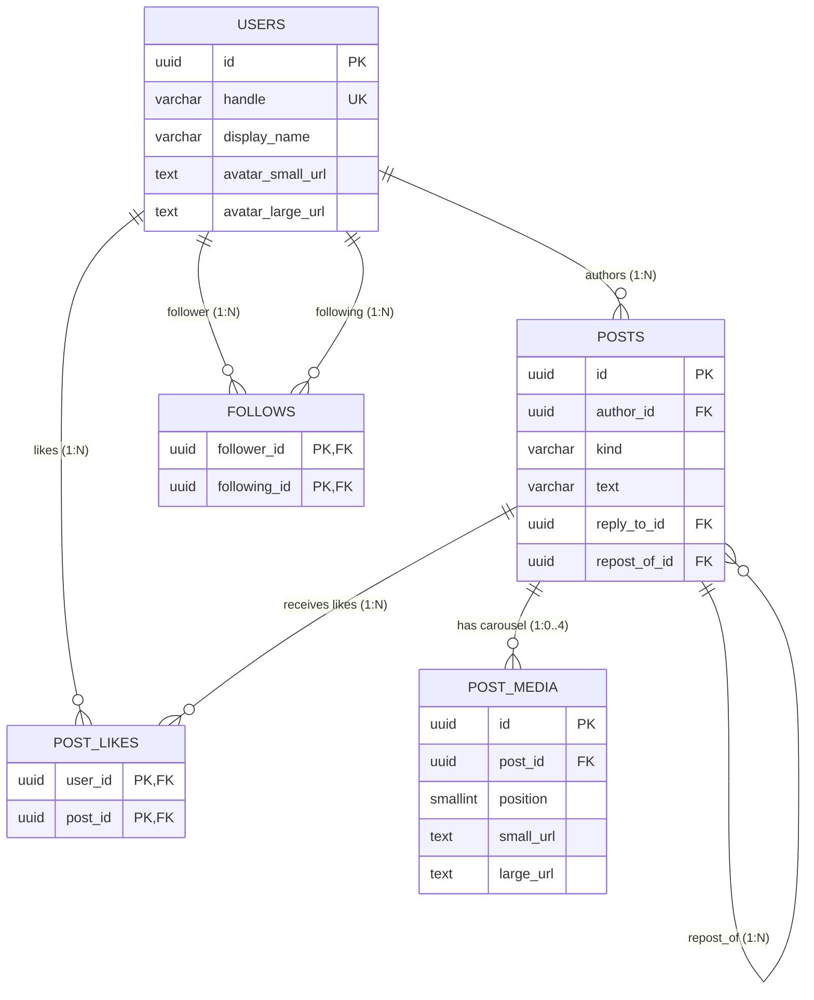

# Database Table Relationships & Cardinality Guide

This document explains all database relationships (1:1, 1:N, M:N, and Self-Referencing) across the 5 tables in the Instagram Social Feed database (`instagram_modeling`).

---

## 📊 Summary of Table Relationships

| # | Relationship | Tables Involved | Relationship Type | Junction / FK Column | Delete Action |
| :--- | :--- | :--- | :--- | :--- | :--- |
| **1** | **User Authors Posts** | `users` $\rightarrow$ `posts` | **1-to-Many (1:N)** | `posts.author_id` $\rightarrow$ `users.id` | `ON DELETE RESTRICT` |
| **2** | **Post Has Media** | `posts` $\rightarrow$ `post_media` | **1-to-Many (1:N)** *(0..4 images)* | `post_media.post_id` $\rightarrow$ `posts.id` | `ON DELETE CASCADE` |
| **3** | **Users Like Posts** | `users` $\leftrightarrow$ `posts` | **Many-to-Many (M:N)** | `post_likes` (`user_id`, `post_id`) | `ON DELETE CASCADE` |
| **4** | **Follow Graph** | `users` $\leftrightarrow$ `users` | **Many-to-Many (M:N)** *(Self-Referencing Graph)* | `follows` (`follower_id`, `following_id`) | `ON DELETE CASCADE` |
| **5** | **Post Replies** | `posts` $\rightarrow$ `posts` | **1-to-Many (1:N)** *(Self-Referencing Tree)* | `posts.reply_to_id` $\rightarrow$ `posts.id` | `ON DELETE RESTRICT` |
| **6** | **Post Reposts** | `posts` $\rightarrow$ `posts` | **1-to-Many (1:N)** *(Self-Referencing Reference)* | `posts.repost_of_id` $\rightarrow$ `posts.id` | `ON DELETE RESTRICT` |

---

## 🔍 Detailed Relationship Explanations

### 1. `users` $\rightarrow$ `posts` (1-to-Many / 1:N)
* **Concept:** One user can create **many** posts (originals, replies, or reposts). Each post is authored by **exactly one** user.
* **Foreign Key:** `posts.author_id` references `users(id)`.
* **Cardinality:** `users (1) ───< (0..N) posts`
* **Rule:** `ON DELETE RESTRICT` prevents accidental deletion of a user if they have active posts in the system.

```text
[User: @asha]
   ├── [Original Post #1]
   ├── [Reply Post #2]
   └── [Repost #3]
```

---

### 2. `posts` $\rightarrow$ `post_media` (1-to-Many / 1:N Carousel)
* **Concept:** One original post can have **0 to 4** carousel media images. Each media row belongs to **exactly one** parent post.
* **Foreign Key:** `post_media.post_id` references `posts(id)`.
* **Cardinality:** `posts (1) ───< (0..4) post_media`
* **Invariants:**
  * `UNIQUE (post_id, position)` ensures slots `0, 1, 2, 3` cannot have collisions.
  * `ON DELETE CASCADE` ensures that deleting a post automatically cleans up all associated media.

```text
[Post: 11111111-...]
   ├── [Media slot 0 (small/large image URL)]
   ├── [Media slot 1 (small/large image URL)]
   └── [Media slot 2 (small/large image URL)]
```

---

### 3. `users` $\leftrightarrow$ `posts` via `post_likes` (Many-to-Many / M:N)
* **Concept:** 
  * A user can like **many posts**.
  * A post can be liked by **many users**.
* **Junction Table:** `post_likes`
* **Composite Primary Key:** `PRIMARY KEY (user_id, post_id)`
  * Enforces that a user can like a specific post **at most once**.
* **Cardinality:**
  * `users (1) ───< (0..N) post_likes`
  * `posts (1) ───< (0..N) post_likes`
* **Rule:** `ON DELETE CASCADE` on both foreign keys removes the like if either the user or the post is deleted.

```text
[User A] ──┐                 ┌── [Post 101]
[User B] ──── [ post_likes ] ──── [Post 102]
[User C] ──┘                 └── [Post 103]
```

---

### 4. `users` $\leftrightarrow$ `users` via `follows` (Many-to-Many Self-Referencing / M:N)
* **Concept:** 
  * A user can follow **many users** (Following).
  * A user can be followed by **many users** (Followers).
* **Junction Table:** `follows`
* **Composite Primary Key:** `PRIMARY KEY (follower_id, following_id)`
  * Enforces single directional relationship between any two users.
* **Invariants:**
  * `CHECK (follower_id <> following_id)` prevents self-follows.
  * `ON DELETE CASCADE` removes edges when an account is deleted.

```text
[User @asha] ──(follows)──> [User @elena]
[User @marcus] ──(follows)──> [User @asha]
```

---

### 5. `posts` $\rightarrow$ `posts` (Self-Referencing 1-to-Many / 1:N)
The `posts` table uses self-referencing foreign keys to handle replies and reposts without needing separate tables:

#### A. Replies (`reply_to_id` $\rightarrow$ `posts.id`)
* An original post can have **many replies**.
* Each reply points to **one parent original post**.
* Direct replies are single-level (replies cannot be replied to).

#### B. Reposts (`repost_of_id` $\rightarrow$ `posts.id`)
* An original post can be reposted by **many users**.
* Each repost points to **one target original post**.
* `UNIQUE (author_id, repost_of_id)` prevents a user from reposting the same post more than once.

---

## 📐 Entity Relationship Diagram (ERD)


